# ConcordiaEats

## E-commerce Web Application in Java Servlets, Spring, and JDBC

## Contributors

- Amin Amani
- Ali Sayedsalehi
- Oleksandr Artemenko
- Mohamamd Reza Nafar
- Jean-Lou Gosselin
- Weiwei Xiao
- Mojtaba Peyrovian

## Features

- **Admin:** Product Management, Promotion Management, Customer Management, Category Management, Login verification
- **Customer:** Registration, Favorites Panel, Profile Management, Basket and Order Management, Best Deals View
  Contact Us Page, Product Recommendation, Category Filter, Product Search, Product Rating, Login verification

## How To Run ?

- 𝗬𝗼𝘂𝘁𝘂𝗯𝗲 𝗽𝗿𝗼𝗷𝗲𝗰𝘁 𝘃𝗶𝗱𝗲𝗼 𝗪𝗼𝗿𝗸𝗶𝗻𝗴 𝗗𝗲𝗺𝗼 + 𝘀𝘁𝗲𝗽 𝗯𝘆 𝘀𝘁𝗲𝗽 𝗲𝘅𝗲𝗰𝘂𝘁𝗶𝗼𝗻 𝗹𝗶𝗻𝗸 : [ click here ](https://youtu.be/c6WWdINWSlI)

- Pre requirement: Eclipse IDE with Spring installed or IntelliJ Idea, mysql Database , xampp (or mysql workbench and Tomcat)

- please make sure you have eclipse ide enterprise for web development if not then re install set up & choose web option.

(1) Download and import project in Eclipse Ide

(2) Make database name :- springproject

(3) import springproject.sql file in database to Create all table

(4) Right click project and run as spring boot & open:- http://localhost:8080/

## log in

ADMIN Module (http://localhost:8080/admin)

- user name: admin
- password : 123

User module

- user name: jay
- password: 123

# Implementation

The web application is implemented using 5 layers: View pages or JSP files, DTO (data transfer object), DAO (data acces object), Controller, Service (handling bussiness logic)

# Tools and Technologies

MySQL  
Java  
JDBC  
Java Spring Framework  
Bootstrap  
HTML  
CSS  
JSP  
Javascript  
Apache Tomcat  
Junit  
Mockito

# preview

## Admin Panel

### Home

Admin can manage categories, products, customers, and promotions from this page

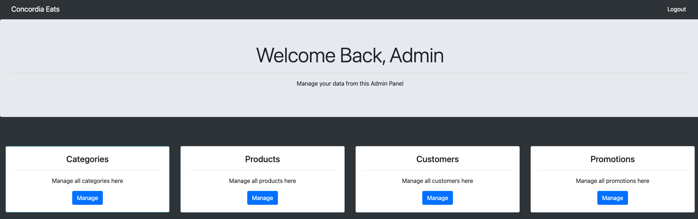

### Category Management

Add, delete, or update a food category

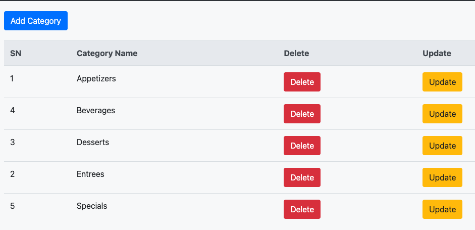

### Product Management

Add, delete, or update a food item and managet food discounts

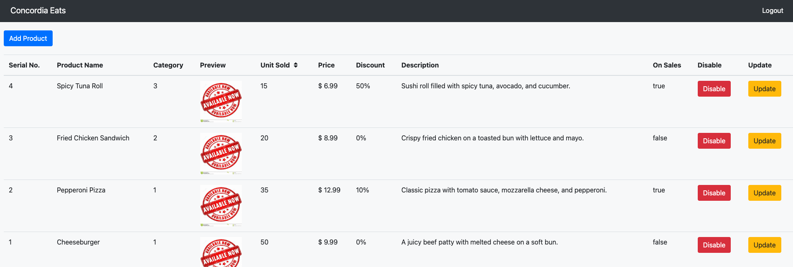

### Customer Management

Delete or update customer info

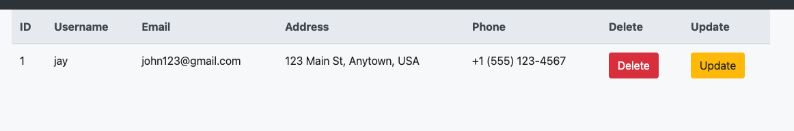

### Promotion Management

Add, delete, or update a promotion
Note: promotions apply to basket and not products

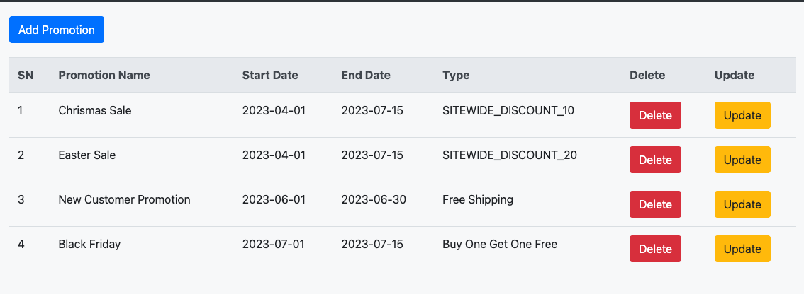

## Customer Experience

### Home

From this page, customers can add products to their basket, rate products, and mark them as favorites. Best deals based on customer history and discounts are shown on top of the page.

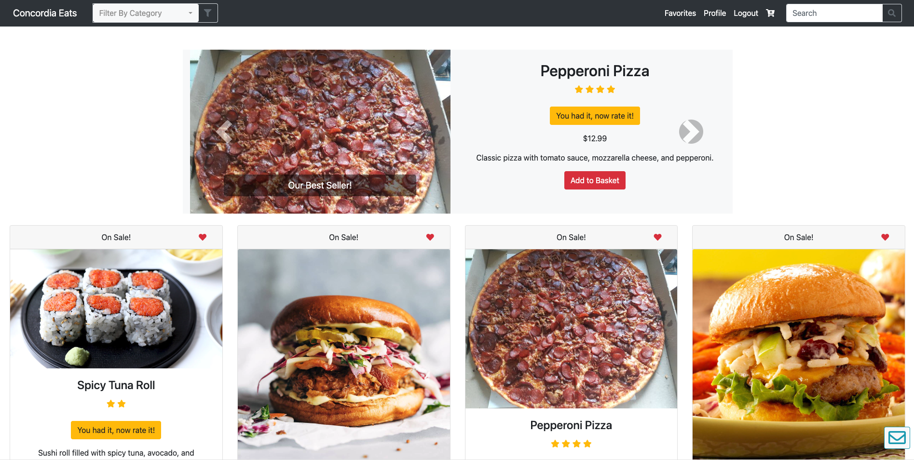

### Registration

New customers can register to have their profile data saved

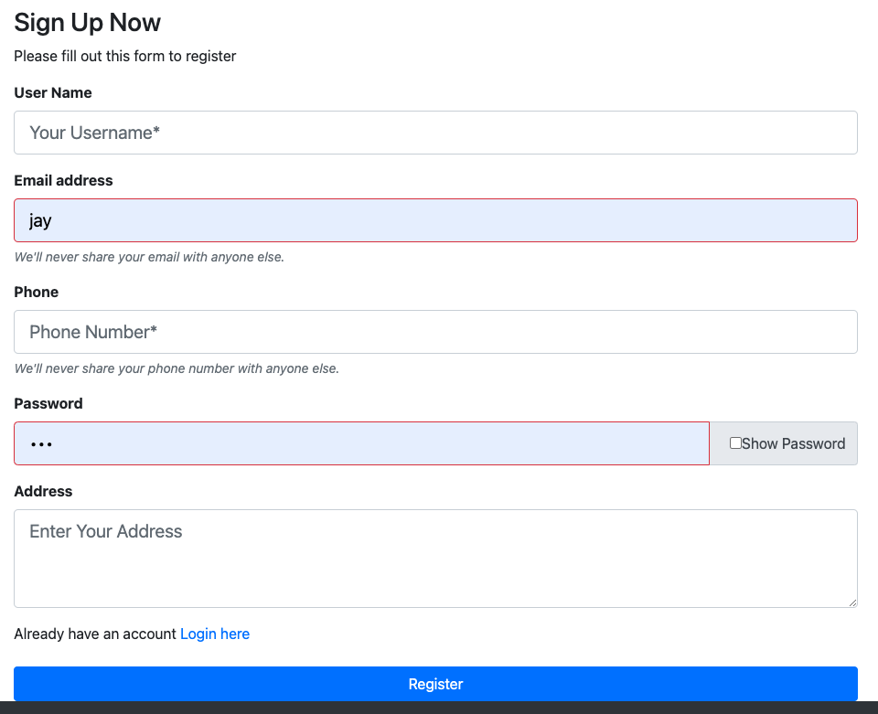

### Profile Management

Users can change their info

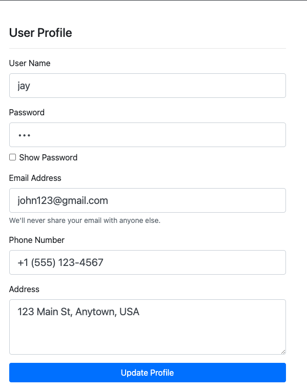

### Favorite Products

Items market with heart icon by customer as his favorite will be shown in his "Favorites" panel

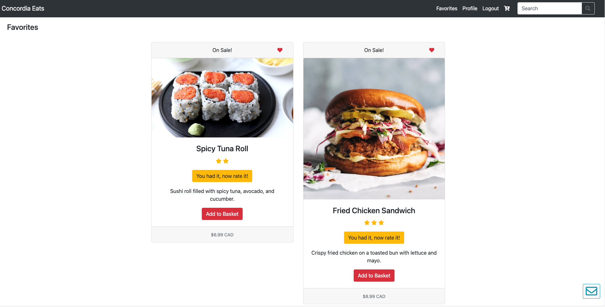

### Rating

Customers can rate the products they bought before

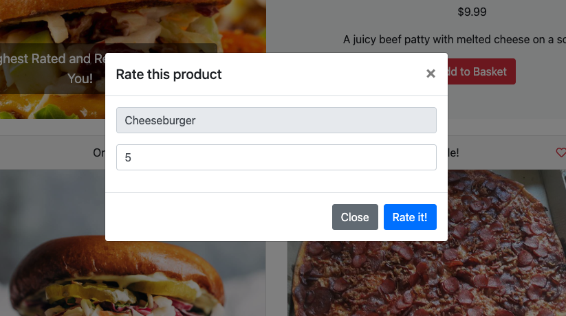

### Basket

Customers can add items to their basket and see the price with promotions applied in real-time

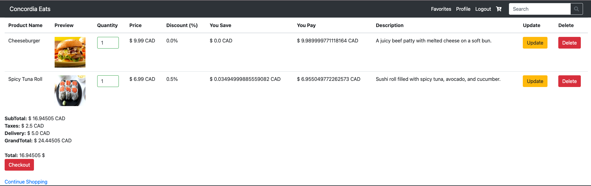

### Contact Us

Users can fill out the contact-us page and their info and questions will be sent to admins through email

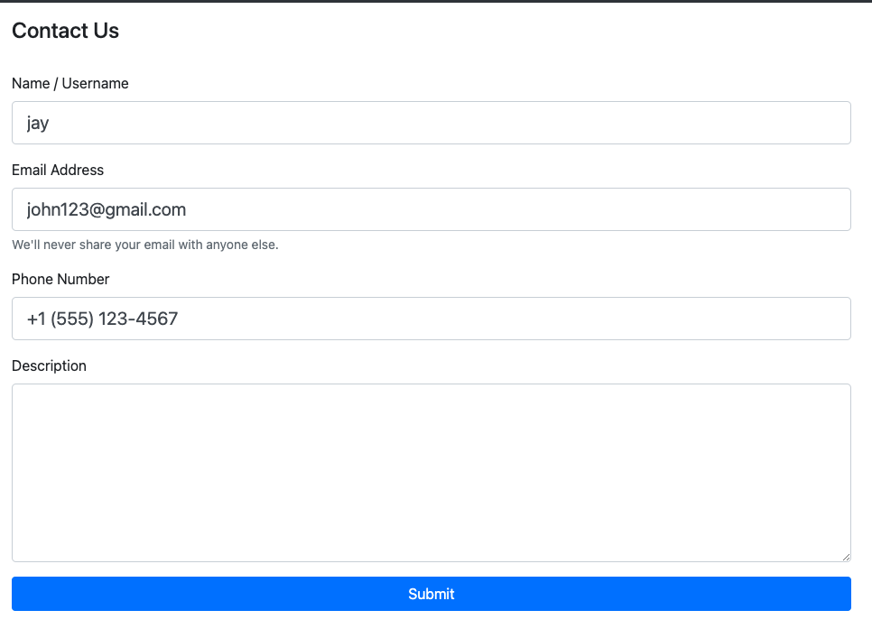

### Checkout

Users can enter their card info and chekcout

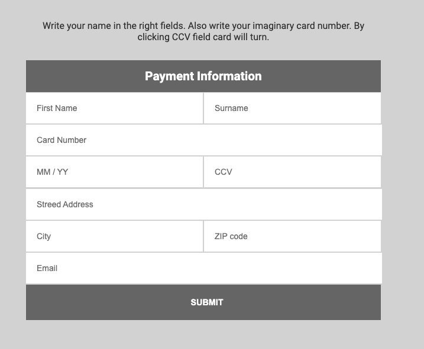

### Category Filter

Users can filter products by category

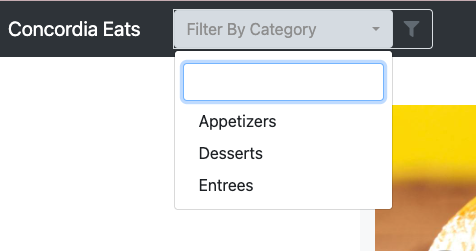
